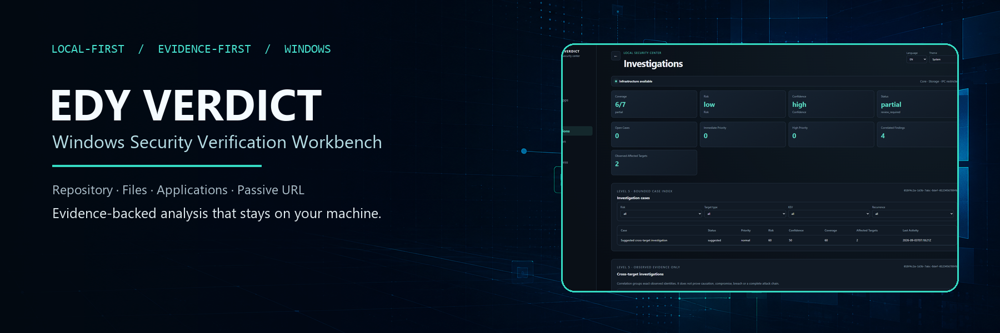
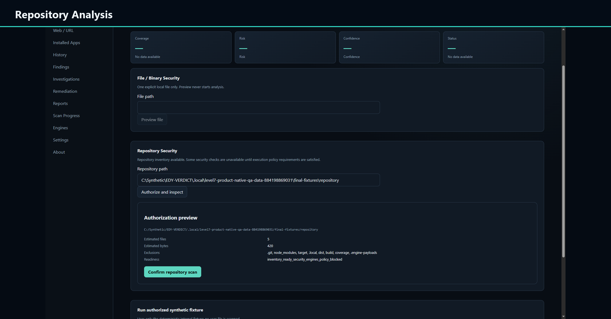
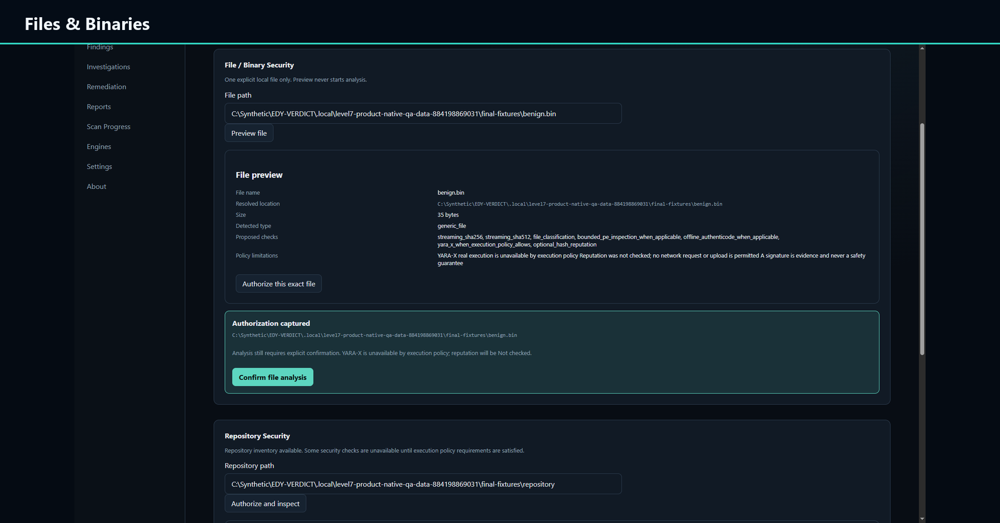
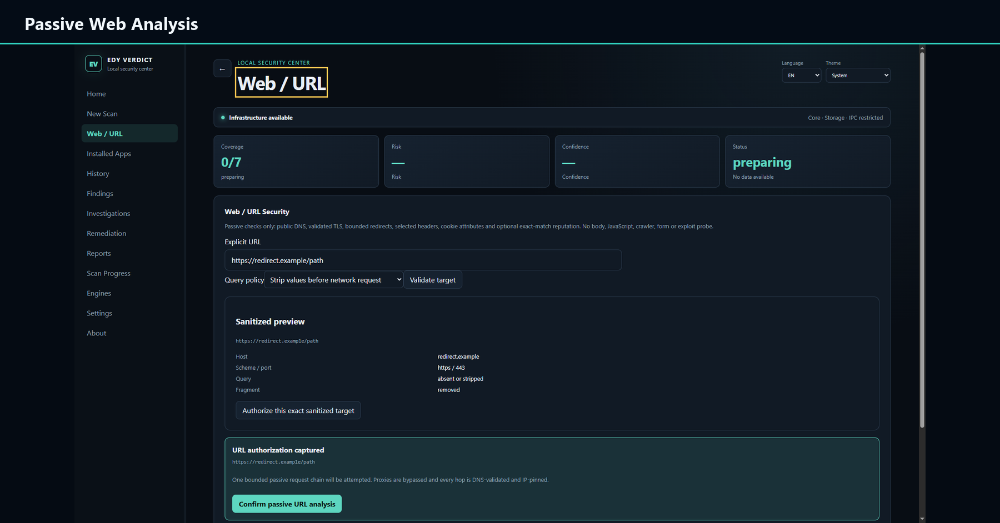
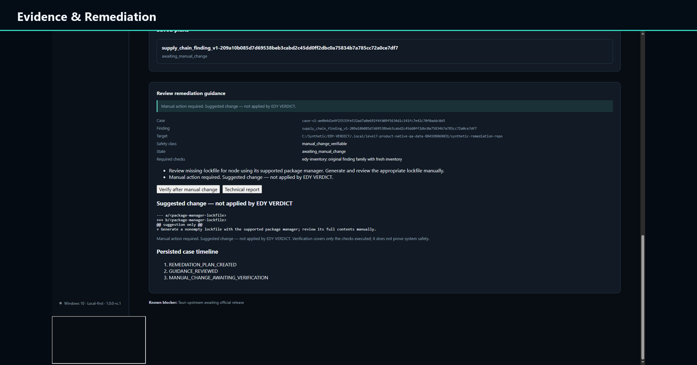

# EDY VERDICT

Local-first Windows security verification workbench for repositories, files, binaries, installed applications, and passive URL analysis.

      



## Video presentation

https://github.com/user-attachments/assets/662263bc-f717-49e2-9feb-4368402be79f

## Overview

EDY VERDICT brings several security-verification workflows into one native Windows workbench. It treats every result as evidence with explicit coverage, risk, confidence, and provenance—never turning a missing check into a clean verdict.

The current `1.0.0-rc.1` repository is a source release candidate. No installer or engine binary is distributed with this RC.

## Highlights

- **Repository Security** — dependency, secret, configuration, and repository-evidence contracts.
- **File & Binary Analysis** — bounded reads, identity binding, metadata, signatures, and optional engine evidence.
- **Installed Applications** — Windows inventory correlated with public vulnerability data.
- **Passive URL Analysis** — explicit authorization, SSRF defenses, redirect limits, DNS rebinding protection, and redaction.
- **Cross-Target Correlation** — cases and graphs that keep observation separate from interpretation.
- **Evidence-First Reporting** — local, redacted technical and investigation reports in PT-BR and English.
- **Local-First Privacy** — SQLite state remains on the device, with no telemetry or automatic support upload.

## Architecture

```text
React UI inside hardened Tauri / WebView2 isolation
                         │ typed, allowlisted IPC
                         ▼
Rust application shell and domain crates
  ├─ authorization + bounded target readers
  ├─ repository / file / application / URL analyzers
  ├─ provider and engine-manager contracts
  ├─ correlation + remediation guidance
  └─ reporting + redaction
                         │
                         ▼
Local SQLite evidence, history, cases, and verification state
```

The frontend has no shell or filesystem capability. CSP, isolation, navigation validation, bounded readers, exact dependency locks, project-local toolchains, and manifest-bound engines form the primary trust boundaries.

## Security and privacy

- Analysis requires an explicit, bounded target and authorization step.
- Files and secrets are never uploaded automatically.
- External providers and future BYOK integrations require deliberate user action.
- Future API keys belong in Windows Credential Manager, never SQLite or logs.
- Unavailable coverage remains visible.
- Production automatic remediation is disabled; guidance and rescan verification are supported.
- SMBIOS identity is treated as `USER_MODIFIED / UNTRUSTED`.

Read the [security policy](SECURITY.md), [threat model](THREAT_MODEL.md), and [privacy model](PRIVACY.md).

## Product tour

### Repository analysis

Bounded inventory and explicit authorization precede every repository scan.


### Files and binaries

File identity, hashing, metadata, signatures, and available engines are recorded as separate evidence.



### Passive web analysis

URL validation is passive, redirect-bounded, DNS-validated, and protected against private-network reachability.



### Evidence and remediation

Suggested changes remain reviewable and manual; verification happens through a fresh scan.



All published captures use bounded synthetic fixtures and exclude real usernames, private paths, installed-software inventory, browsing data, credentials, tokens, and machine identifiers.

## Build from source

Prerequisites: Windows 10 Pro 22H2 x64 build 19045 or later, Git, Visual Studio Build Tools with MSVC x64 and Windows SDK, WebView2 Evergreen Runtime, Rust `1.98.0`, Node.js `24.20.0`, and pnpm `11.25.0`.

```powershell
git clone https://github.com/EDY075/EDY-VERDICT.git
Set-Location EDY-VERDICT

# Review first: this provisions pinned project-local developer toolchains.
.\scripts\Provision-Toolchains.ps1

# Load process-local Rust, Node, pnpm and MSVC configuration.
. .\scripts\Enter-Project.ps1

pnpm install --frozen-lockfile --ignore-scripts
pnpm build
.\scripts\Invoke-ProjectRust.ps1 -Action WorkspaceTest
```

The supported public path for this candidate is **build from source**. Do not distribute a local unsigned installer as a release.

## Validation

The frozen Level 7 candidate records:

- 16 architecture tests and 90 frontend tests.
- 302 active Rust tests, plus 4 intentionally ignored authorization/network tests.
- Clippy with warnings denied, rustfmt, TypeScript, ESLint, and a production frontend build.
- Native Tauri/WebView2/React/typed-IPC/SQLite E2E at `1366×768`, `1920×1080`, and `2560×1440`.
- SQLite schema 8 integrity and restart persistence.
- Secret scanning, hostile redaction sentinels, `cargo audit`, and `pnpm audit`.

Detailed evidence is in the [Level 7 report](docs/LEVEL_7_REPORT.md) and [release checklist](docs/release-checklist.md).

## Current limitations

- This is a release candidate, not a stable or production-certified release.
- Real external engine execution may remain policy-blocked.
- Web analysis is passive; reputation providers are optional.
- Portable applications are not fully inventoried.
- Correlation supports investigation but does not prove causation.
- The installer is unsigned and has not completed clean-machine acceptance.
- `cargo audit` reports zero vulnerabilities and 17 allowed warnings from transitive dependencies; five unsuppressed `unic-*` maintenance advisories inherited through Tauri remain visible in `cargo deny` with no safe upgrade currently available.

## Documentation

- [Architecture foundation](docs/architecture/foundation-contract.md)
- [Security policy](SECURITY.md)
- [Threat model](THREAT_MODEL.md)
- [Privacy](PRIVACY.md)
- [Support](SUPPORT.md)
- [Contributing](CONTRIBUTING.md)
- [Publication audit](docs/security/PUBLICATION_AUDIT.md)
- [GitHub About recommendation](docs/GITHUB_ABOUT.md)
- [Third-party notices](THIRD_PARTY_NOTICES.md)

## License

EDY VERDICT code and content owned by Edmilson Gomes are licensed under the [MIT License](LICENSE), Copyright (c) 2026 Edmilson Gomes. Dependencies remain subject to their respective licenses; see [THIRD_PARTY_NOTICES.md](THIRD_PARTY_NOTICES.md).
