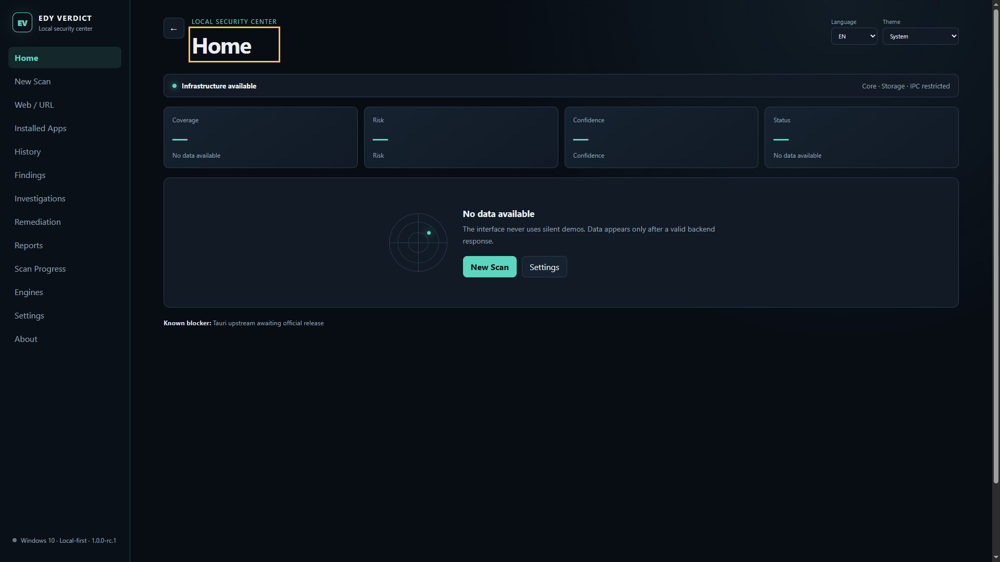
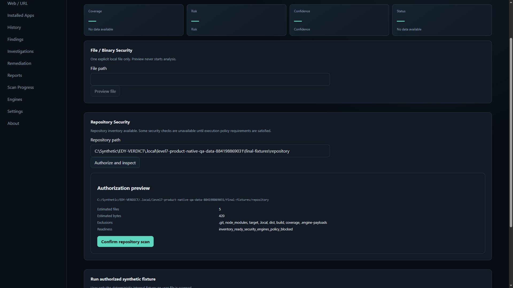
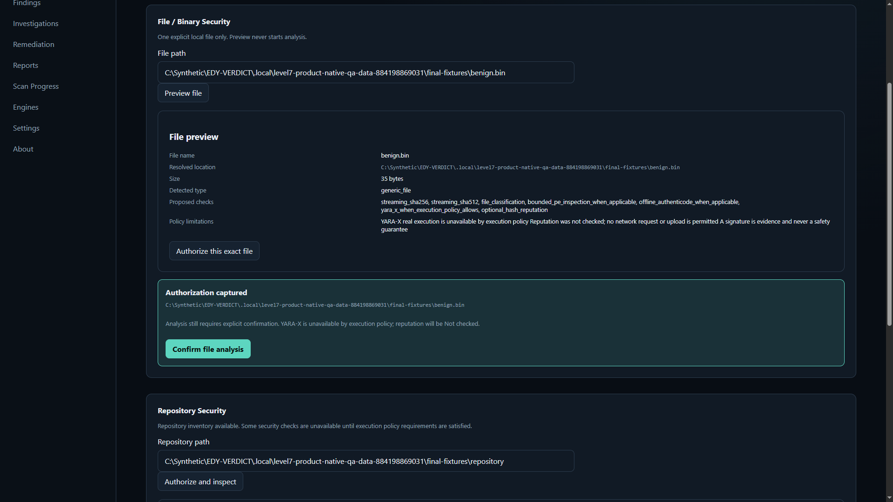
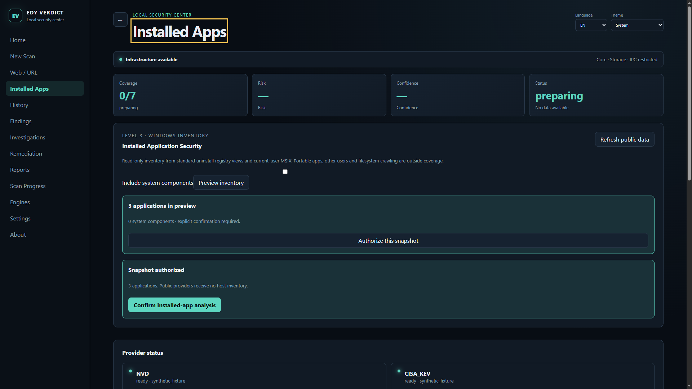
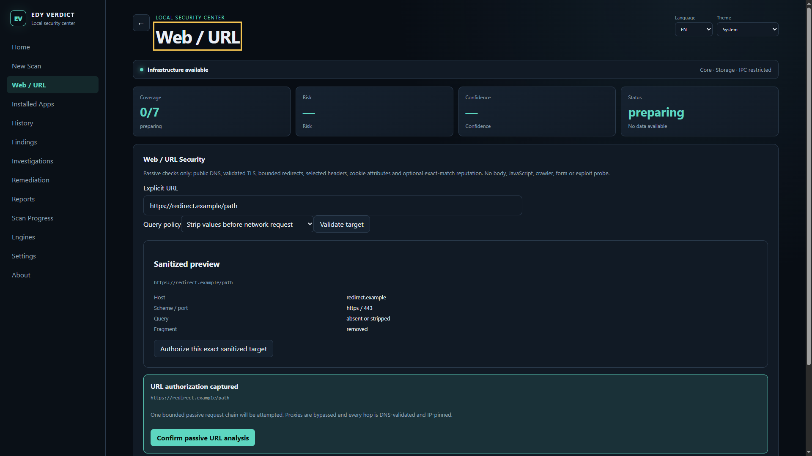
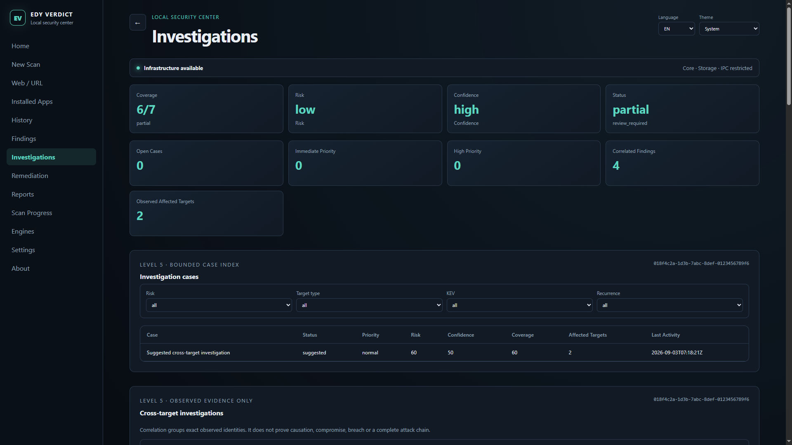
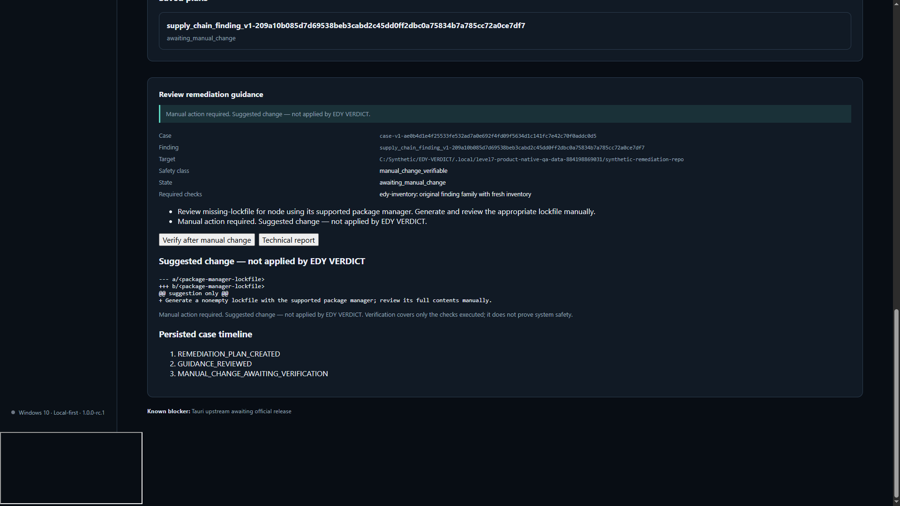
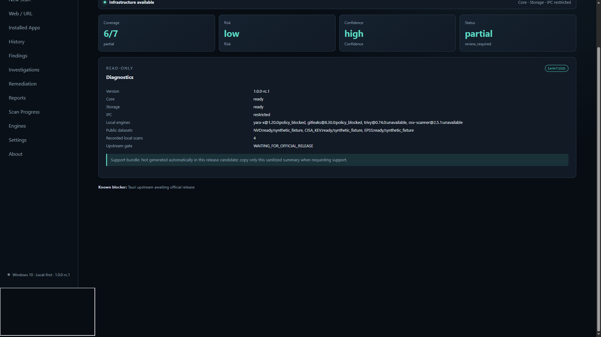

# EDY VERDICT

EDY VERDICT is a local-first Windows security verification workbench for repositories, files and binaries, installed applications, and passive web/URL analysis. It correlates evidence across targets while keeping **coverage**, **risk**, and **confidence** separate.

**Current version:** `1.0.0-rc.1`<br>
**Channel:** Release Candidate<br>
**Platform:** Windows 10 Pro 22H2 x64 (build 19045) or later<br>
**License:** [MIT](LICENSE)

This repository publishes the source release candidate. No installer or engine binary is distributed with this RC.

## Product tour

| Home | Repository analysis |
|---|---|
|  |  |

| File and binary analysis | Installed applications |
|---|---|
|  |  |

| Passive web/URL analysis | Cross-target investigation |
|---|---|
|  |  |

| Remediation guidance | Diagnostics |
|---|---|
|  |  |

Every screenshot uses bounded synthetic fixtures. It contains no real username, private path, installed-software inventory, browsing data, credential, token, or secret.

## What it does

- Authorizes and analyzes a repository without treating missing checks as a pass.
- Inspects files and binaries with path hardening, identity binding, metadata, signatures, and bounded evidence handling.
- Inventories installed Windows applications and correlates package and vulnerability evidence.
- Performs passive URL checks with SSRF, redirect, DNS-rebinding, and redaction controls.
- Builds cross-target cases and an investigation graph without claiming that correlation proves causation.
- Provides remediation guidance and verifies manual changes by rescanning; production automatic remediation is disabled.
- Generates local, redacted technical and investigation reports in Portuguese (Brazil) and English.

## Analysis areas

| Area | Candidate capability | Boundary |
|---|---|---|
| Repository security | Dependency, secret, configuration, and repository evidence contracts | Real external engine execution may be policy-blocked |
| File/binary security | File identity, metadata, Authenticode, and bounded binary evidence | Unavailable checks reduce coverage |
| Installed applications | Windows inventory plus public vulnerability datasets | Portable applications are not fully inventoried |
| Web/URL security | Explicitly authorized passive analysis | No active exploitation; reputation providers are optional |
| Investigations | Cross-target clustering, cases, graph, and reports | Correlation does not prove causation |
| Remediation | Guidance, suggested diffs, rescan, and manual-change verification | No production auto-apply or rollback |

## Architecture

```text
React UI inside hardened Tauri/WebView2 Isolation
                    │ typed, allowlisted IPC
                    ▼
Rust application shell and domain crates
  ├─ authorization and bounded target readers
  ├─ repository / file / application / URL analyzers
  ├─ provider and engine-manager contracts
  ├─ correlation and remediation guidance
  └─ reporting and redaction
                    │
                    ▼
Local SQLite evidence, history, cases, and verification state
```

The frontend has no shell or filesystem capability. CSP, Isolation, origin/navigation validation, typed IPC, bounded readers, exact dependency locks, project-local tooling, and manifest-bound engines form the main trust boundaries. See [THREAT_MODEL.md](THREAT_MODEL.md) and [SECURITY.md](SECURITY.md).

## Security and privacy model

- Local-first: SQLite state and reports remain on the device.
- No telemetry and no automatic support upload.
- Files and secrets are never uploaded automatically.
- Network providers and future BYOK integrations require explicit user action.
- Future API keys belong in Windows Credential Manager, never SQLite or logs.
- Unavailable coverage remains visible and never becomes a clean verdict.
- Microsoft Defender is an optional provider and may remain disabled by user choice.
- SMBIOS identity is treated as `USER_MODIFIED / UNTRUSTED`.

Read [PRIVACY.md](PRIVACY.md) for the complete data-handling boundary.

## Current limitations

- This is a Release Candidate, not a stable or production-certified release.
- Real external engine execution may remain policy-blocked.
- Web/URL analysis is passive; URL reputation is optional.
- Portable applications are not fully inventoried.
- Production automatic remediation is disabled; guidance and manual-change verification are supported.
- Cross-target correlation is evidence for investigation and does not prove causation.
- The installer is unsigned, has not completed clean-machine acceptance, and is intentionally not distributed.

### Known upstream release limitation

Tauri `2.11.5` is currently pinned. The dependency graph contains five known `unic-*` advisories inherited through the current Tauri dependency chain. No `cargo-deny` exceptions are used. `cargo audit` reports zero vulnerabilities in the audited project graph.

EDY VERDICT will migrate to the corrected stable Tauri release after upstream publication and regression validation. Until then, the public release is source-only and remains a pre-release.

## Build from source

Prerequisites:

- Windows 10 Pro 22H2 x64 build 19045 or later
- Git
- Visual Studio Build Tools with MSVC x64 and a Windows SDK
- WebView2 Evergreen Runtime
- Rust `1.98.0` (`x86_64-pc-windows-msvc`)
- Node.js `24.20.0` and pnpm `11.25.0`

The repository deliberately binds development tools and caches to `.local/` inside the checkout. Review [AGENTS.md](AGENTS.md) and the pinned acquisition logic in `scripts/Provision-Toolchains.ps1` before provisioning tools.

```powershell
git clone https://github.com/EDY075/EDY-VERDICT.git
Set-Location EDY-VERDICT

# Review first; this provisions pinned project-local developer toolchains.
.\scripts\Provision-Toolchains.ps1

# Load the process-local Rust, Node, pnpm and MSVC environment.
. .\scripts\Enter-Project.ps1

pnpm install --frozen-lockfile --ignore-scripts
pnpm build
.\scripts\Invoke-ProjectRust.ps1 -Action WorkspaceTest
```

Do not use a local unsigned installer as a public release. The supported public path for this candidate is **Build from source**.

## Validation evidence

The frozen Level 7 candidate passed:

- 16 architecture tests
- 90 frontend tests
- 256 active Rust tests, with 4 intentionally ignored authorization/network tests
- Clippy with warnings denied, rustfmt, TypeScript, ESLint, and production frontend build
- Native Tauri/WebView2/React/typed-IPC/SQLite E2E at `1366×768`, `1920×1080`, and `2560×1440`
- SQLite schema 8 integrity and restart persistence
- secret scanning and hostile redaction sentinels
- `cargo audit` with zero vulnerabilities and `pnpm audit` with zero vulnerabilities

The five upstream `unic-*` findings remain visible in `cargo deny`; they are not suppressed. See [docs/LEVEL_7_REPORT.md](docs/LEVEL_7_REPORT.md) and [docs/release-checklist.md](docs/release-checklist.md).

## Release status

| Item | Status |
|---|---|
| Product implementation / roadmap Levels 0–7 | Complete |
| Public source release candidate | Available |
| Public installer | Not distributed |
| Stable `v1.0.0` | Pending |
| Corrected stable Tauri upgrade | Pending upstream release and regression validation |

## License

EDY VERDICT code and content owned by Edmilson Gomes are licensed under the [MIT License](LICENSE), Copyright (c) 2026 Edmilson Gomes.

Dependencies and third-party components remain subject to their respective licenses. See [THIRD_PARTY_NOTICES.md](THIRD_PARTY_NOTICES.md) and the generated dependency inventory/SBOM under `docs/security/generated/`.
